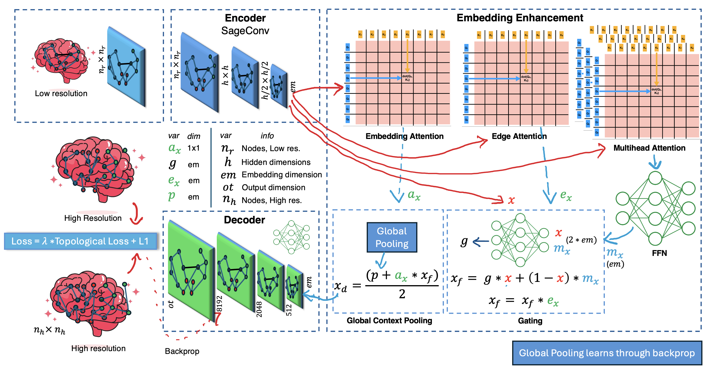
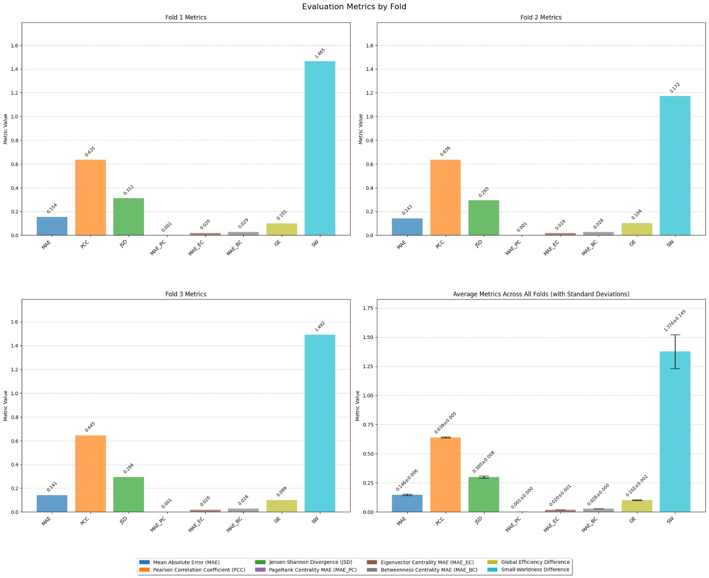

# Brain Graph Super-Resolution Challenge

## Contributors

**Team Name**: NPDBR  
**Members**:

- Prajit Sengupta
- Devvrat Joshi
- Nishita Jain
- Bhavay Pahuja
- Rishideep Chatterjee

---

## Problem Description

Brain graph super-resolution aims to reconstruct high-resolution (HR) brain connectivity graphs from low-resolution (LR) counterparts. HR brain graphs are crucial for understanding neural connectivity, but are expensive and difficult to obtain. Super-resolution enables better analysis of brain networks, improving diagnostics and treatment for neurological disorders. Graph Neural Networks (GNNs) offer powerful tools to learn these complex topological structures, making them ideal for this task.

---

## Model Name: ImprovedGraphSRModel - Methodology

Our **ImprovedGraphSRModel** combines **GraphSAGE layers**, **edge attention**, **multi-head self-attention**, and a **gating mechanism** to enhance both local and global brain graph structures.

- **GraphSAGE** layers extract local node features.
- **Edge attention** dynamically weighs brain region connections.
- **Multi-head self-attention** captures long-range dependencies.
- **Gating mechanism** fuses raw and transformed node features.
- A **global pooling** vector provides a whole-brain context.
- **MLP decoder** generates the HR graph, with a final sigmoid for valid outputs.

---

## Model Architecture



---

## Used External Libraries

Our code uses standard Python libraries, including PyTorch and PyTorch Geometric.  
To install required packages:

```bash
pip install numpy pandas torch torch-geometric scikit-learn torch_scatter
```

---

---

## Results

We evaluated our model using **3-fold cross-validation** on 167 samples, using 8 metrics.

### Fold-wise Results

| Fold | MAE    | PCC    | JSD    | MAE_PC | MAE_EC | MAE_BC | GE     | SW     |
| ---- | ------ | ------ | ------ | ------ | ------ | ------ | ------ | ------ |
| 1    | 0.1544 | 0.6350 | 0.3115 | 0.0010 | 0.0204 | 0.0285 | 0.1012 | 1.4646 |
| 2    | 0.1426 | 0.6360 | 0.2935 | 0.0010 | 0.0186 | 0.0280 | 0.1040 | 1.1717 |
| 3    | 0.1413 | 0.6451 | 0.2940 | 0.0010 | 0.0196 | 0.0282 | 0.0994 | 1.4924 |

### Overall Results (Averaged Across Folds)

| Metric                                 | Mean ± Std. Dev. |
| -------------------------------------- | ---------------- |
| **Mean Absolute Error**                | 0.1461 ± 0.0059  |
| **Pearson Correlation Coefficient**    | 0.6387 ± 0.0045  |
| **Jensen-Shannon Distance**            | 0.2997 ± 0.0084  |
| **Average MAE PageRank Centrality**    | 0.0010 ± 0.0000  |
| **Average MAE Eigenvector Centrality** | 0.0195 ± 0.0007  |
| **Average MAE Betweenness Centrality** | 0.0282 ± 0.0002  |
| **Global Efficiency**                  | 0.1015 ± 0.0019  |
| **Small-Worldness**                    | 1.3762 ± 0.1451  |

- **Kaggle Scores**: Public Set — 0.123713, Private Set — 0.148975
- **Kaggle Rank**: **6**
  

---

- Comparison of model performance across different folds for key evaluation metrics. The final panel represents the average performance with error bars indicating standard deviations.
  

## References

1. N. Rajadhyaksha and I. Rekik, “Diffusion-based graph super-resolution with application to connectomics,” _Int. Workshop on PRedictive Intelligence In MEdicine_, Springer, 2023.
2. P. Singh and I. Rekik, “Strongly topology-preserving GNNs for brain graph super-resolution,” _arXiv preprint_, 2024.
3. M. Isallari and I. Rekik, “Brain graph super-resolution using adversarial GNN,” _arXiv preprint_, 2021.
4. V. Latora and M. Marchiori, “Efficient behavior of small-world networks,” _Phys. Rev. Lett._, 2001.
5. E. Bullmore and O. Sporns, “Complex brain networks: analysis of structural and functional systems,” _Nat. Rev. Neurosci._, 2009.
6. D. J. Watts and S. H. Strogatz, “Collective dynamics of ‘small-world’ networks,” _Nature_, 1998.
